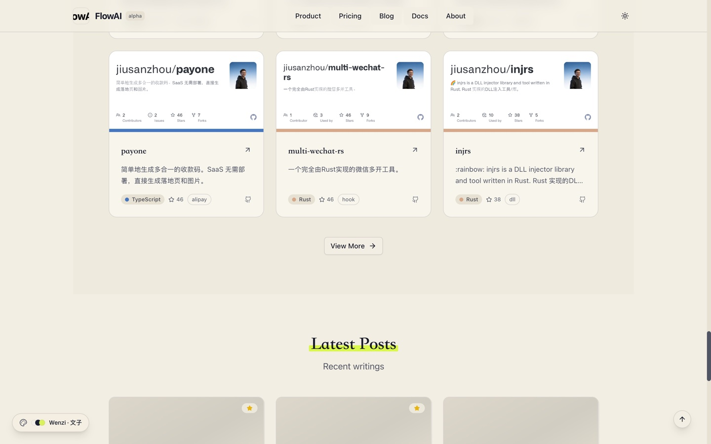
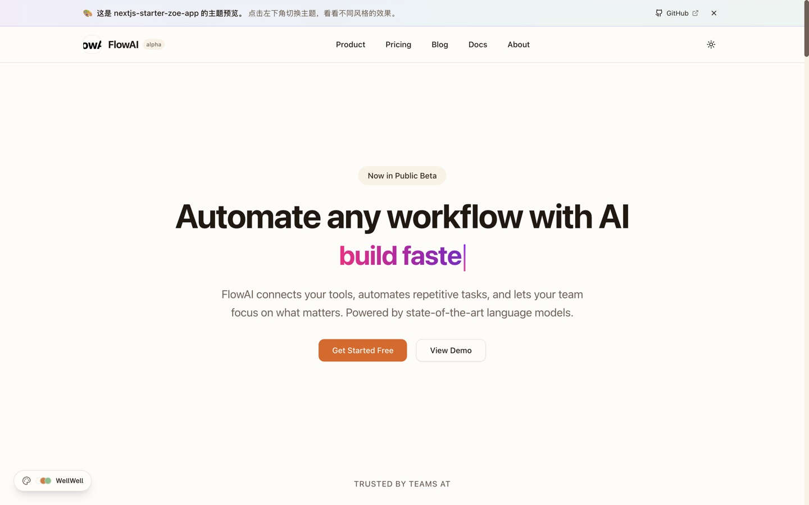
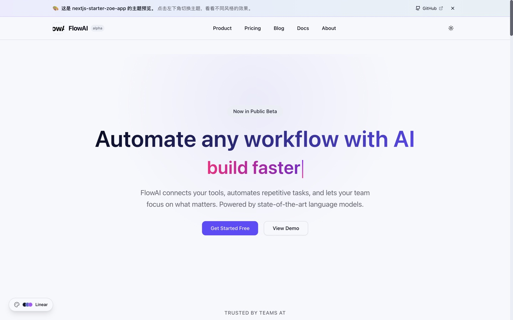
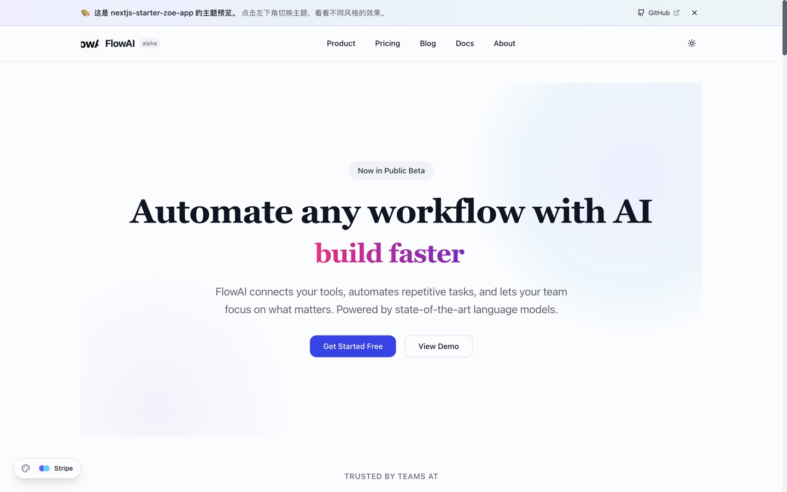
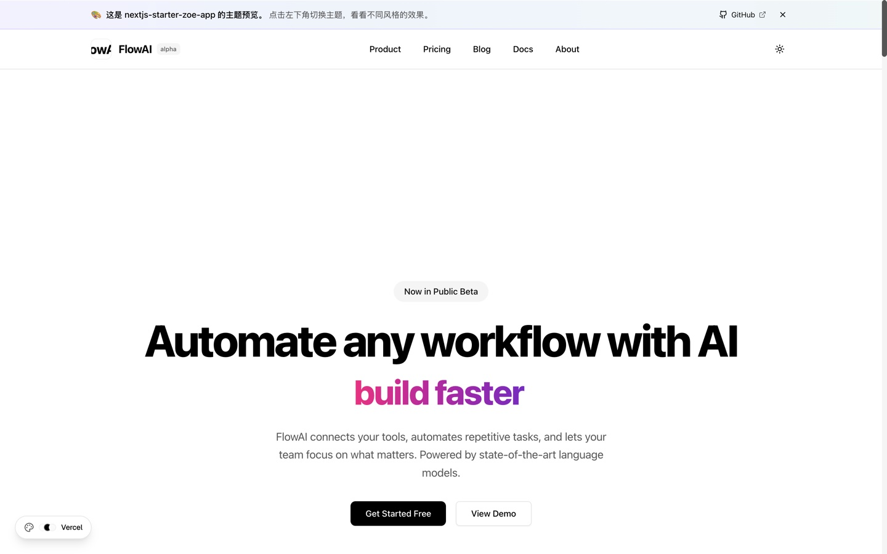
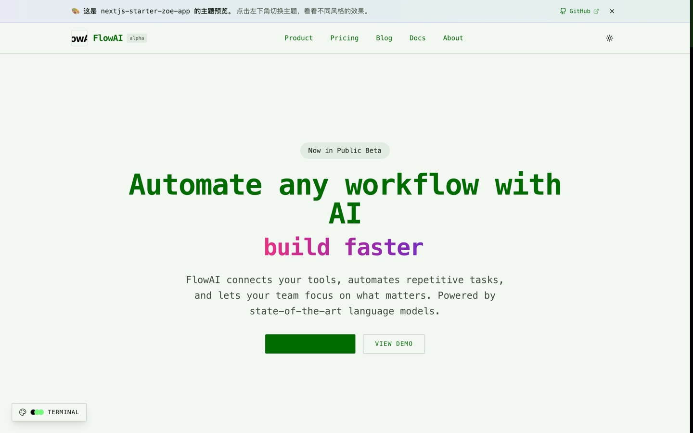
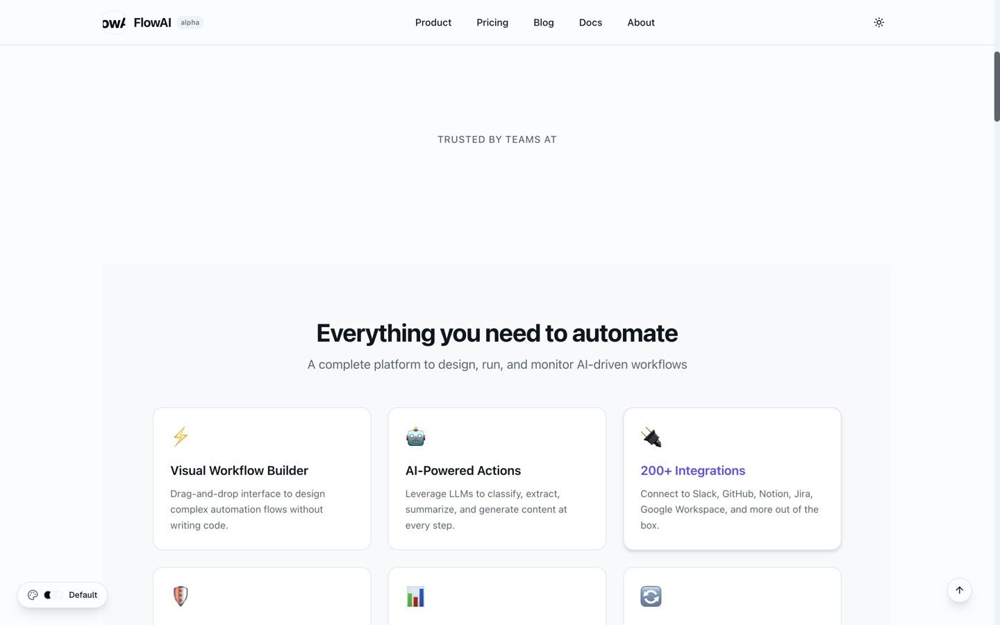

# nextjs-starter-zoe-app

> A config-driven, production-ready website starter built with Next.js, shadcn/ui, and Tailwind CSS. Ship landing pages, SaaS sites, developer tools, and personal blogs — all from a single YAML file.

<div align="center">

[](https://nextjs.org/)
[](https://react.dev/)
[](https://typescriptlang.org/)
[](https://tailwindcss.com/)
[](./LICENSE)

</div>

---

## 🎨 Live Demo

**[👉 zoe.im/nextjs-starter-zoe-app](https://zoe.im/nextjs-starter-zoe-app/)** — Click the palette button (bottom-left) to switch themes live. URL is shareable.

Try any theme directly:

| Theme | Style | Preview |
|-------|-------|---------|
| **Wenzi · 文子** | 纸感杂志风，奶油米黄底 + 撞色高光 | [?theme=wenzi](https://zoe.im/nextjs-starter-zoe-app/?theme=wenzi) |
| **WellWell** | 暖橙 + 自然绿，"好好工作 = 好好生活" | [?theme=wellwell](https://zoe.im/nextjs-starter-zoe-app/?theme=wellwell) |
| **Linear** | 深蓝紫，玻璃质感，AI/科技感 | [?theme=linear](https://zoe.im/nextjs-starter-zoe-app/?theme=linear) |
| **Stripe** | 紫青渐变，鲜亮活力 | [?theme=stripe](https://zoe.im/nextjs-starter-zoe-app/?theme=stripe) |
| **Vercel** | 纯黑白，极简开发风 | [?theme=vercel](https://zoe.im/nextjs-starter-zoe-app/?theme=vercel) |
| **Terminal** | 黑底绿字，黑客美学 | [?theme=terminal](https://zoe.im/nextjs-starter-zoe-app/?theme=terminal) |
| **Default** | 优雅中性色调 | [?theme=default](https://zoe.im/nextjs-starter-zoe-app/?theme=default) |

### Real-world sites built with this starter

- **[zoe.im](https://zoe.im)** — Zoe 的个人主页（`default` 主题）
- **[wellwell.work](https://wellwell.work)** — 好好工作 · WellWell Work（`wellwell` 主题）

> 💡 Both sites are pure data repositories — the framework is pulled at build time via GitHub Actions. See [wellwellwork.github.io](https://github.com/wellwellwork/wellwellwork.github.io) for the data-only setup pattern.

---

## Highlights

- **Config-driven** — One `zoe-site.yaml` controls site metadata, navigation, sections, themes, and content.
- **Zero-fork deployment** — Your repo only contains `zoe-site.yaml` + `content/`. The theme is pulled at build time. See [`docs/deployment.md`](./docs/deployment.md).
- **7 production themes** — Switch with one line: `theme: wenzi`. Live preview above, screenshots [below](#themes).
- **11 section types** — Hero, Features, Logos, Testimonials, Stats, Pricing, FAQ, CTA, Posts, Projects, Contact.
- **Built-in `/releases` page** — Auto-aggregate GitHub/Gitee releases into a download landing page. See [`docs/releases.md`](./docs/releases.md).
- **Static export** — Pure HTML output. Deploy anywhere (Vercel, Netlify, GitHub Pages, S3, …).
- **Blog system** — MDX/Markdown with tags, archives, pinned posts, drafts, RSS.
- **Dark mode** — System-aware light/dark toggle (orthogonal to color themes).
- **SEO ready** — Auto metadata, Open Graph, sitemap.xml, robots.txt.
- **Fully typed** — TypeScript end-to-end.

---

## Quick Start

### Option A — Zero-fork (recommended for content sites)

Your repo only needs `zoe-site.yaml` + `content/`. The theme is fetched at build time and cached.

```bash
# Scaffold a new site
curl -sSL https://git.io/zoe-site | bash -s new my-site
cd my-site

# Dev server (http://localhost:3000)
curl -sSL https://git.io/zoe-site | bash -s dev

# Build static site → ./out
curl -sSL https://git.io/zoe-site | bash -s build
```

For convenience, install the script once:

```bash
curl -sSL https://git.io/zoe-site -o ~/.local/bin/zoe-site && chmod +x ~/.local/bin/zoe-site

zoe-site dev
zoe-site build
```

### Option B — Clone the theme (for customization)

```bash
npx degit jiusanzhou/nextjs-starter-zoe-app my-site
cd my-site
pnpm install
pnpm dev        # http://localhost:3000
pnpm build      # static export → ./out
```

Then edit `zoe-site.yaml`, `src/`, or `content/` directly.

---

## Themes

Seven first-class themes ship out of the box. Set in `zoe-site.yaml`:

```yaml
theme: wenzi
```

Or switch live via the palette button at [zoe.im/nextjs-starter-zoe-app](https://zoe.im/nextjs-starter-zoe-app/).

<table>
<tr>
<td width="50%" align="center">
<a href="./docs/showcase/wenzi.jpg"></a>
<br/>
<sub><code>wenzi · 文子</code> — Paper-cream + magazine accents. Personal brand, editorial.</sub>
</td>
<td width="50%" align="center">
<a href="./docs/showcase/wellwell.jpg"></a>
<br/>
<sub><code>wellwell</code> — Warm orange + natural green. Indie studios, build-in-public.</sub>
</td>
</tr>
<tr>
<td align="center">
<a href="./docs/showcase/linear.jpg"></a>
<br/>
<sub><code>linear</code> — Dark indigo + glass morphism. AI/ML startups, tech products.</sub>
</td>
<td align="center">
<a href="./docs/showcase/stripe.jpg"></a>
<br/>
<sub><code>stripe</code> — Purple/cyan gradient. SaaS, fintech, landing pages.</sub>
</td>
</tr>
<tr>
<td align="center">
<a href="./docs/showcase/vercel.jpg"></a>
<br/>
<sub><code>vercel</code> — Pure black & white, geometric. Dev tools, documentation.</sub>
</td>
<td align="center">
<a href="./docs/showcase/terminal.jpg"></a>
<br/>
<sub><code>terminal</code> — Green-on-black, retro. Hacker aesthetic, CLI tools.</sub>
</td>
</tr>
<tr>
<td align="center">
<a href="./docs/showcase/default.jpg"></a>
<br/>
<sub><code>default</code> — Elegant neutral tones. Personal sites, blogs.</sub>
</td>
<td align="center">
<em>Want more?</em><br/>
Add a custom theme in <a href="./src/styles/themes.css"><code>src/styles/themes.css</code></a>
and register it in <a href="./src/components/theme-switcher.tsx"><code>theme-switcher.tsx</code></a>.
</td>
</tr>
</table>

> All themes ship with both light and dark variants. The color theme (e.g. `wenzi`) and light/dark mode are independent — they can be combined freely.

---

## Section Types

Build your homepage by composing sections in `zoe-site.yaml`:

| Section | Description |
|---|---|
| `hero` | Main banner with badge, typing animation, CTA buttons, optional image/video |
| `features` | Feature grid (cards/icons/bento style, 2–4 columns) |
| `logos` | Logo bar (scrolling marquee or static grid) |
| `testimonials` | Customer quotes with avatar, role, company |
| `stats` | Key-metric callouts |
| `pricing` | Pricing plans with highlighted tier |
| `faq` | Accordion Q&A |
| `cta` | Call-to-action band (simple/gradient/card) |
| `posts` | Latest blog posts |
| `projects` | GitHub project showcase |
| `contact` | Contact info / social links |

---

## Configuration

Everything lives in `zoe-site.yaml`. Minimal example:

```yaml
title: My Product
description: One-line description that shows up in <meta>
theme: stripe
lang: en

navs:
  - { title: Product, href: /#features }
  - { title: Pricing, href: /#pricing }
  - { title: Blog,    href: /blog }

sections:
  - type: hero
    badge: "New"
    greeting: Build something great
    description: Your product description here
    cta:
      - { text: "Get Started", href: /signup }
    align: left

  - type: features
    title: Features
    columns: 3
    style: cards
    items:
      - { icon: "⚡", title: Fast, description: Blazing fast performance }

  - type: pricing
    title: Pricing
    plans:
      - { name: Free, price: "$0", features: [Feature A, Feature B] }
      - { name: Pro,  price: "$29", features: [Everything in Free, Feature C], highlighted: true }
```

### Example configs

Drop-in starting points in [`examples/`](./examples/):

| File | Theme | Best for |
|---|---|---|
| [`personal-site.yaml`](./examples/personal-site.yaml) | `default` | Personal blog & portfolio |
| [`saas-product.yaml`](./examples/saas-product.yaml) | `stripe` | AI workflow automation product |
| [`developer-tool.yaml`](./examples/developer-tool.yaml) | `vercel` | Minimal developer tool site |
| [`startup.yaml`](./examples/startup.yaml) | `linear` | AI infrastructure startup |

```bash
cp examples/saas-product.yaml zoe-site.yaml
```

---

## Content

Drop Markdown/MDX files into `content/`:

```
content/
├── posts/
│   └── my-first-post.md
├── pages/
│   └── about.md
└── projects/
    └── cool-project.md
```

Post frontmatter:

```yaml
---
title: My Post
description: Optional summary for previews & SEO
date: 2024-01-01
tags: [ai, automation]
pinned: false        # pin to top of /blog
published: true      # set false → goes to /blog/drafts
---
```

MDX components like `<AppRelease />`, `<PricingTable />`, `<Lottie />`, `<TypingText />` are available inside posts. See [`src/components/mdx/components.tsx`](./src/components/mdx/components.tsx).

---

## App Releases

Built-in `/releases` landing page aggregates downloads + changelogs from GitHub/Gitee. Just add to `zoe-site.yaml`:

```yaml
# Single repo (shorthand)
releaseRepo: "owner/repo"

# Multi-repo with custom asset matching
releaseRepo:
  - provider: github
    repo: owner/repo
    assetRegexPatterns:
      android: "\\.apk$"
      macos: "\\.dmg$"
```

What you get:
- Multi-platform download buttons (Android/iOS/macOS/Windows/Linux), auto-detected from release assets
- Server-side Markdown rendering for release notes (remark + GFM + shiki)
- 1-hour ISR cache for the landing page
- `GITHUB_TOKEN` support (60→5000 req/h on CI)
- Embeddable `<AppRelease repo="owner/repo" />` for MDX posts

Full reference: [`docs/releases.md`](./docs/releases.md).

---

## Deployment

Static export to `./out` (no Node runtime needed at the edge). Three ready-to-use GitHub Actions workflows in [`examples/github-actions/`](./examples/github-actions/):

| File | Use case |
|---|---|
| [`deploy-gh-pages.yml`](./examples/github-actions/deploy-gh-pages.yml) | One-click GitHub Pages |
| [`deploy-vercel.yml`](./examples/github-actions/deploy-vercel.yml) | Vercel via `amondnet/vercel-action` |
| [`build-only.yml`](./examples/github-actions/build-only.yml) | PR previews / validation (uploads artifact) |

Copy one into `.github/workflows/deploy.yml` in your content repo and push. The script auto-detects your `zoe-site.yaml` + `content/` and injects them into the theme via env vars.

For project pages (sub-path):

```yaml
env:
  ZOE_BASE_PATH: /my-repo
```

Full deployment guide: [`docs/deployment.md`](./docs/deployment.md).

---

## CLI

The `scripts/zoe-site.sh` script is self-contained — pipe it from `curl` or install once and run forever.

```
Usage: zoe-site [command]

Commands:
  dev               Start dev server (http://localhost:3000)
  build             Build static site → $ZOE_OUTPUT_DIR (default: ./out)
  start             Build + serve production
  new <name>        Scaffold a new project
  help              Show this help

Environment:
  ZOE_THEME_REPO     Theme repo (default: jiusanzhou/nextjs-starter-zoe-app)
  ZOE_THEME_BRANCH   Branch (default: main)
  ZOE_CACHE_DIR      Cache dir (default: ~/.cache/zoe-site)
  ZOE_OUTPUT_DIR     Output dir (default: $PWD/out)
  ZOE_BASE_PATH      basePath for sub-path deploy (e.g. /my-repo)
  GITHUB_TOKEN       Bumps /releases API rate limit
```

---

## Tech Stack

- **Next.js 16** — App Router, React Server Components, Static Export, Turbopack
- **React 19** — Concurrent features, Suspense, RSC
- **Tailwind CSS 4** — Zero-config, utility-first
- **shadcn/ui** — Radix + Tailwind components
- **MDX 3** — Markdown + JSX with `next-mdx-remote`
- **remark / shiki** — Markdown processing + syntax highlighting
- **TypeScript 5** — Strict mode end-to-end

---

## Documentation

- [`docs/deployment.md`](./docs/deployment.md) — CI/CD, GitHub Pages, Vercel, env vars
- [`docs/releases.md`](./docs/releases.md) — `/releases` landing page reference
- [`scripts/zoe-site.sh`](./scripts/zoe-site.sh) — One-liner CLI source

## License

MIT © [Zoe](https://zoe.im)
